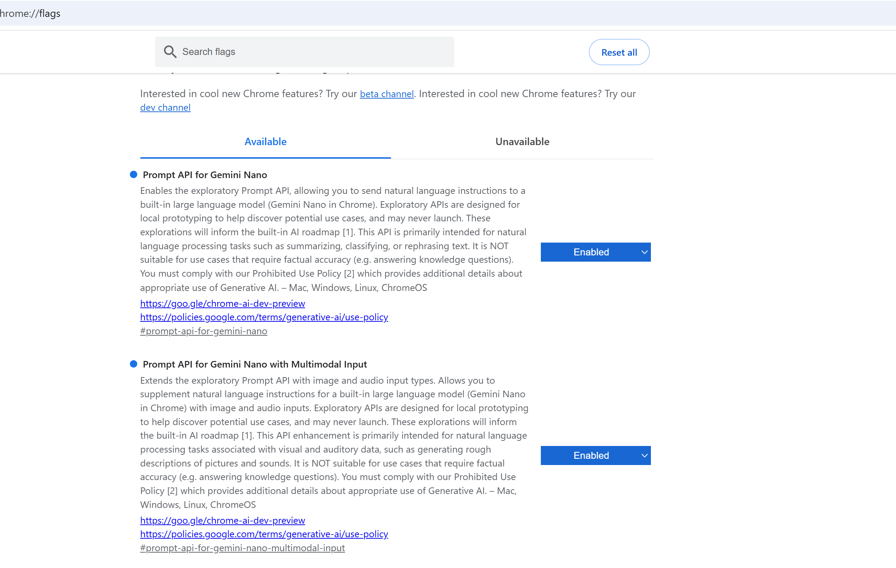

# Chrome Prompt API Example

A modern, full-screen **chat-style web interface** powered by **Chrome’s Prompt API (Gemini Nano)**.

This project mimics real chat applications with:
- Left/right message bubbles  
- An AI typing indicator with animated dots  
- Input locking to prevent sending multiple messages while the AI is responding  

The app runs **entirely in the browser**, requires a **user gesture** for model initialization (as per Chrome security rules), and supports basic markdown-style formatting like `**bold**`.

---

## ✨ Features

- 💬 Full-screen, WhatsApp-style chat UI  
- 🤖 Chrome Prompt API (`LanguageModel`) integration  
- ⏳ AI typing indicator (animated three-dot loader)  
- 🔒 Input disabled while awaiting AI response  
- 🧠 Session-based conversational memory  
- ✨ Lightweight markdown support (`**bold**`)  
- ⌨️ Enter-to-send support  
- 🌐 No backend required  

---

## 🧰 Tech Stack

- HTML  
- CSS  
- JavaScript  
- Chrome Prompt API (Gemini Nano)

---

## ⚙️ Prerequisites

Before running this project, you **must enable the required Chrome flags**.



### Enable Chrome Prompt API flags

Open Chrome and navigate to:
chrome://flags


Enable the following flags:

- **Prompt API for Gemini Nano**
- **Prompt API for Gemini Nano with Multimodal Input**

After enabling the flags, **restart Chrome**.

---

## 🚀 Getting Started
1. Clone the repository:
   ```bash
   git clone https://github.com/pradeeppanayal/chromepromptapiexample.git
2. Open the project folder:

   ```bash
   cd chromepromptapiexample

3. Open `index.html` in Google Chrome
(Other browsers are not supported.)

4. Type a message and click Send to initialize the model
(A user gesture is required by the Prompt API).

## 🔒 Important Notes
The Prompt API requires a user gesture (button click or key press) to create a model session.

Automatic initialization on page load will result in a NotAllowedError.

An output language must be explicitly specified (e.g. "en").

## 🌍 Supported Output Languages
Currently supported by the Prompt API:

en – English

es – Spanish

ja – Japanese

## 📸 Preview


## 📄 License
MIT License
Feel free to use, modify, and distribute.


